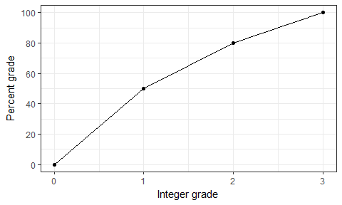

Assignments
================

Assignments will be posted here as they are made available.

(Information about the peer review can now be found on the [peer review page](peer-review.html).)

Schedule
--------

Here are the deadlines for assignments, with links (to appear after assignments are released). All submissions are due by 23:59.

### STAT 545

| Assignment                    | Assignment Due Date |
|-------------------------------|---------------------|
| [Homework 01](hw01/hw01.html) | September 18, 2018  |
| [Homework 02](hw02/hw02.html) | September 25, 2018  |
| [Homework 03](hw03/hw03.html) | October 02, 2018    |
| [Homework 04](hw04/hw04.html) | October 09, 2018    |
| Homework 05                   | October 19, 2018    |

### STAT 547

| Assignment  | Assignment Due Date |
|-------------|---------------------|
| Homework 06 | November 09, 2018   |
| Homework 07 | November 13, 2018   |
| Homework 08 | November 20, 2018   |
| Homework 09 | November 27, 2018   |
| Homework 10 | December 06, 2018   |

Logistics
---------

Here is the general flow that will happen for the assignments.

1.  When an assignment is released, I will post a GitHub Issue in [Discussion-Internal](https://github.com/STAT545-UBC/Discussion-Internal), tagging the teaching team and students (you should get an email notification, too, unless you've somehow disabled this, are not `Watch`ing the Discussion-Internal repo, or did not inform me of your GitHub username).
2.  You will be prompted to create a repository through GitHub Classroom. Develop your homework responses on this repository, which will be contained in the [STAT545-UBC-students](https://github.com/STAT545-UBC-students) Organization.
3.  Upon completion, it would be useful for you to submit a link to your URL in the UBC Canvas page. We will be putting your grades there.

Evaluation
----------

Components of each assignment will be graded on a 3-point scale. Here is the general rubric (*also consult any specific guidance given in the relevant assignment itself*).

<table style="width:36%;">
<colgroup>
<col width="6%" />
<col width="9%" />
<col width="11%" />
<col width="8%" />
</colgroup>
<thead>
<tr class="header">
<th>Topic</th>
<th>Excellent: 3</th>
<th>Satisfactory: 2</th>
<th>Needs work: 1</th>
</tr>
</thead>
<tbody>
<tr class="odd">
<td>Coding style</td>
<td>Student has gone beyond what was expected and required, coding manual is followed, code is well commented</td>
<td>Coding style lacks refinement and has some errors, but code is readable and has some comments</td>
<td>Many errors in coding style, little attention paid to making the code human readable</td>
</tr>
<tr class="even">
<td>Coding strategy</td>
<td>Complicated problem broken down into sub-problems that are individually much simpler. Code is efficient, correct, and minimal. Code uses appropriate data structure (list, data frame, vector/matrix/array). Code checks for common errors</td>
<td>Code is correct, but could be edited down to leaner code. Some &quot;hacking&quot; instead of using suitable data structure. Some checks for errors.</td>
<td>Code tackles complicated problem in one big chunk. Code is repetitive and could easily be functionalized. No anticipation of errors.</td>
</tr>
<tr class="odd">
<td>Presentation: graphs</td>
<td>Graph(s) carefully tuned for desired purpose. One graph illustrates one point</td>
<td>Graph(s) well chosen, but with a few minor problems: inappropriate aspect ratios, poor labels.</td>
<td>Graph(s) poorly chosen to support questions.</td>
</tr>
<tr class="even">
<td>Presentation: tables</td>
<td>Table(s) carefully constructed to make it easy to perform important comparisons. Careful styling highlights important features.</td>
<td>Table(s) generally appropriate but possibly some minor formatting deficiencies.</td>
<td>Table(s) with too many, or inconsistent, decimal places. Table(s) not appropriate for questions and findings. Major display problems.</td>
</tr>
<tr class="odd">
<td>Achievement, mastery, cleverness, creativity</td>
<td>Student has gone beyond what was expected and required, e.g., extraordinary effort, additional tools not addressed by this course, unusually sophisticated application of tools from course.</td>
<td>Tools and techniques from the course are applied very competently and, perhaps,somewhat creatively. Chosen task was acceptable, but fairly conservative in ambition.</td>
<td>Student does not display the expected level of mastery of the tools and techniques in this course. Chosen task was too limited in scope.</td>
</tr>
<tr class="even">
<td>Ease of access for instructor, compliance with course conventions for submitted work</td>
<td>Access as easy as possible, code runs!</td>
<td>Satisfactory</td>
<td>Not an earnest effort to reduce friction and comply with conventions and/or code does not run</td>
</tr>
</tbody>
</table>

The grade mapping is as follows:

| Grade | Percentage |
|-------|------------|
| 0     | 0%         |
| 1     | 50%        |
| 2     | 80%        |
| 3     | 100%       |

Intermediate points are allowed, and follow a linear scale in between each point, so that the full mapping is depicted in the following chart:

Peer Review
-----------

Information about the peer review can now be found on the [peer review page](peer-review.html).
