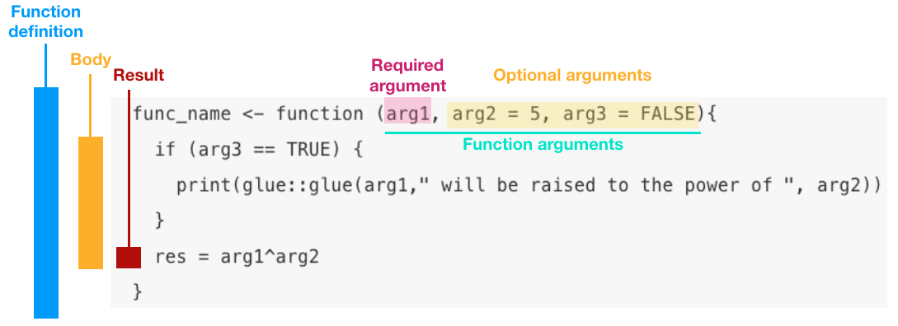
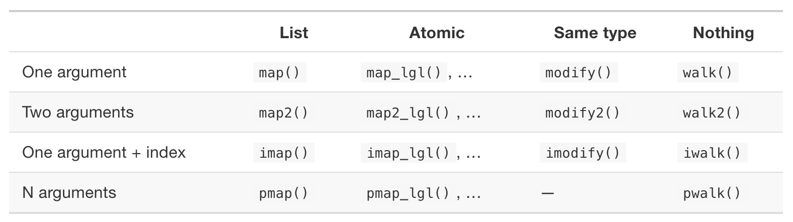

# (3) Functional programming in R: Part I

```{r include=FALSE}
knitr::opts_chunk$set(echo=TRUE, warning=FALSE, message=FALSE)
```

```{r}
library(tidyverse)
library(glue)
library(tictoc)
```

## Today's Agenda

- Announcements:
  - Reminder about Assignment 1 and 2
  - Milestone 2 is now posted
  - Office hours are on Tuesday & Thursday after class in this room, and on Fridays from 10-12 in ESB 1045.
    - See [here for the schedule](https://stat545.stat.ubc.ca/officehours/)
  - [Download today's participation file](https://github.com/STAT547-UBC-2019-20/Discussions/blob/master/participation/cm103/cm103_participation.Rmd) (and commit into your participation repo)

- Part 1: Introduction to functional programming (FP) (10 mins) 
  - Motivation for functions and for vectorizing operations
  - Anatomy of a function in R
  - Comments on RScript vs. RMarkdown vs. RNotebook
  
- Part 2: Vectorization
  - What is vectorization?
  - Why do we use vectorization?
  - Examples of vectorized operations in R

- Part 3: Functional programming using the `purrr` package
  - `purrr::map`
  - Use the right `purrr::map*` function based on your desired output
  - Specify some arguments of the function
  - Mapping with two data objects
  - Mapping with more than two data objects
  
## Learning outcomes for this lecture

1. Define the philosophy of functional programming in R.
1. Describe the benefits of vectorizing R code.
1. Apply vectorization to tasks in R. 
1. List and describe the `map` functions from the `purrr` package.
1. Apply functions from the `purrr` package to vectorize tasks in R.
1. Describe anonymous functions, apply them, and use the shorthand notation in `purrr` functions.

## Part 1: Introduction to functional programming (FP) (10 mins)

### Motivation for functions and for vectorizing operations
  - [Hadley Wickham's cupcake recipes](https://speakerdeck.com/hadley/the-joy-of-functional-programming?slide=13)  
  
### Anatomy of a function in R



```{r}
func_name <- function (arg1, arg2 = 5, arg3 = TRUE) {
  
  if (arg3 == TRUE) {
    print(glue::glue(arg1," will be raised to the power of ", arg2))
  }
  arg1^arg2
}
func_name(4)
```

### Rscript vs. RMarkdown vs. RNotebook

## Part 2: Vectorization

Many thanks to one of our teaching assistants [Sirine Chahma](https://github.com/sirine-chahma) for the first draft of this lecture!

### What is vectorization?

There are several ways of applying the same operation to all the elements of a given vector.

You can "brute force" it:

```{r, bruteforce_multiplication}
x <- c(1, 2, 3, 4)
y <- c()

y[1] = x[1]*2
y[2] = x[2]*2
y[3] = x[3]*2
y[3] = x[4]*2
```

But it's very easy to make mistakes when you're copy/pasting code like this so it's a good rule of thumb to think of better ways to do things when you have to copy and paste the same block of code more than about once.

Let's try this again:

```{r, bruteforce_multiplication2}
x <- c(1, 2, 3, 4)
y <- c()

y[1] = x[1]*2
y[2] = x[2]*2
y[3] = x[2]*2
y[4] = x[4]*2

y
```

Rats! We made another mistake. 
Find and fix the mistake in the code above please!

Okay, let's get to the better way of doing things.

You can use a loop : 

```{r, loop_multiplication}
x <- c(1, 2, 3, 4)
y <- c()

for (i in 1:length(x)){
  y[i] <- x[i]*2
}

y
```

There is a function called `seq_along` that essentially replaces `1:length(x)` in the code chunk above:

```{r, loop_multiplication2}
x <- c(1, 2, 3, 4)
y <- c()

for (i in seq_along(x)){
  y[i] <- x[i]*2
}

y
```
We will use `seq_along(x)` and `1:length(x)` interchangeably. 

So, this works and is much less error-prone, but in this case - there is actually an even better option, - vectorized operations! 
Let's see an example of it:

```{r, vectorized_multiplication}
x <- c(1, 2, 3, 4)

y <- x*2
y
```

You might have thought this was an obvious thing to try, and you'd be right - R has some built in functions to handle vectorization "behind the scenes".
For example, we can sum the values of two vectors :  

```{r, loop_addition}
x1 <- c(1, 2, 3, 4)
x2 <- c(10, 20, 30, 40)
y <- c()

for (i in 1:length(x1)){
  y[i] <- x1[i] + x2[i]
}

y
```

but built-in vectorization in R allows us to do this: 

```{r, vectorized_addition}
x1 <- c(1, 2, 3, 4)
x2 <- c(10, 20, 30, 40)

y <- x1 + x2
y
```

### Why do we use vectorization?

Let's come back to the first example we saw (multiply the values of a vector by 2), but let's use a bigger vector this time.


```{r, create_big_vector}
x <- 1:100000000
print(glue('The length of x is ', length(x)))
```

Take a guess at how long the loop below is going to take to run (Hint: the answer is "in the seconds")?

```
# Guess at how long this loop takes

x <- 1:100000000
for (i in 1:length(x)){
  y[i] <- 2*x[i]
}

## YOUR GUESS HERE
```
Let's try using the `tictoc` package to time how long this operation takes.
`tic` starts the clock, and `toc` stops the clock and prints out the total time.

```{r, long_loop, eval = FALSE}

y <- c()

#start timing
tic()
for (i in 1:length(x)){
  y[i] <- 2*x[i]
}

#end timing
toc()
```

Let's take a look at the time taken by the vectorized operation now : 

```{r, long_vectorization}

#start timming
tic()

y <- x*2

#end timming
toc()
```

Wow! That is amazing - see how much faster the vectorized operation is compared to the `for` loop.
It's usually recommended to use vectorized operation rather than regular loops for several reasons, including memory efficiency, speed, readability, "debugability", and easily being able to add tests (more on this next week).

### Examples of vectorized operations

Here are a few examples of other operations that are vectorized.

- Check if the values of two vectors are the same : 

```{r, boolean_equal}

x1 <- c(1, 2, 3, 4)
x2 <- c(1, 2, 1, 2)

y <- x1 == x2

# Can you guess the values of `y`?
print("YOUR GUESS HERE")
```

And the answer is (run in RStudio):
```{r, answer_boolean_equal, eval = FALSE}
y
```

- Compare the values of two vectors :

```{r, boolean_greater}

x1 <- c(1, 2, 3, 4)
x2 <- c(1, 2, 1, 2)

y <- x1 > x2

# Can you guess the values of `y`?
print("YOUR SOLUTION HERE")
```

And the answer is: 

```{r, answer_boolean_greater, eval = FALSE}
y
```

- Logical comparaisons can also be used: 

```{r, logical}

# compares each elements of each vector by position
y <- c(TRUE, TRUE, TRUE) & c(FALSE, TRUE, TRUE)
y
```

There are a lot of other operations that are vectorized! 
Here is a list of vector operators : [R Operators cheat sheet](https://cran.r-project.org/doc/contrib/Baggott-refcard-v2.pdf)

## Part 3: Functional programming using the `purrr` package

Until now, we have just applied simple operations to vectors. 
The functions were only applied to a single element of the vector, which were doubles. 
What if we want to use data frames (as you likely will in your projects)? 
In this case, one "element" becomes a whole vector (a column of the data frame), and the functions have to accept a vector as an input. 

Let's now try to work with data frames. 
How do we apply a function to all the columns of a data frame?

We are going to work with the `iris` data frame : 

```{r, load_df}
#select only the columns that represents a numerical variable
iris_df <- iris %>% 
  select(-Species)

head(iris_df)
```

Let's compute the mean of each column using a for loop :

```{r,, mean_loop}
means <- vector("double", ncol(iris_df))

## YOUR SOLUTION HERE
for (i in seq_along(iris_df)) {
    means[i] <- mean(iris_df[[i]], na.rm = TRUE)
}
```

`means` contains the means of each column : 

```{r, answer_mean_loop, eval = FALSE}
means
```

We can do the same to find the minimum of each column : 

```{r, min_loop}
mins <- vector("double", ncol(iris_df))

## YOUR SOLUTION HERE
for (i in seq_along(iris_df)) {
    mins[i] <- min(iris_df[[i]], na.rm = TRUE)
}
```

`mins` contains the minimums of each column : 

```{r, answer_min_loop, eval = FALSE}
mins
```

The two loops we just wrote seem to very similar to each other, we should try to write a function that takes the function we want to apply and a data frame as its inputs.

```{r, my_map_function}

my_function <- function(x, fun)  {
    value <- vector("double", ncol(x))
    for (i in seq_along(x)) {
        value[i] <- fun(x[[i]], na.rm = TRUE)
    }
    value
}
```

Let's check if we find the same values as before. 
Try calling `my_function` to compute the `mean` and `min` of `iris_df`: 

```{r, my_function_mean}
## YOUR SOLUTION HERE
my_function(iris_df, mean)
```

```{r, my_function_min}
## YOUR SOLUTION HERE
my_function(iris_df, min)
```

We find exactly the same values as when we were using the for loop! 

*Note*: We have just written a functional, which is a *function* that takes *another function* as an input, and returns a vector as an output. 

Just as a preview, the `purrr` package has some really convenient function(al)s that allow us to pass in other functions to apply to data frame. 

### The most general `purrr` function: `map`

The `purrr:map` function takes at least two arguments : a data frame and a function.

`map(.x, .f, ...)`

This means that we are going to apply the function `f` for every element of `x`.

This image may help you to better understand what does the `purrr:map` function does : 


Source: [Advanced R](https://adv-r.hadley.nz/index.html) by Hadley Wickham.

*Note* : In this image, the elements of the object that are used as an input seem to be the rows, but when we use a data frame as the input, they actually correspond to the columns of the data frame.

Let's calculate the mean of the columns of the iris data frame : 

```{r, purrr_mean_map}
library(purrr)
map(iris_df, mean)
```

The only difference with our `my_function` function we created above is that the output is a list! 

### Use the right `purrr::map*` function based on your desired output

Now, let's take a look at the other functions that exist in the `purrr` library.
Here is a [cheatsheet](https://github.com/rstudio/cheatsheets/blob/master/purrr.pdf) that contains a list of all the functions, and how to use them.
We have `map_chr` (character vector), `map_dbl` (double/numeric vector), `map_dfc` (dfc for dataframe columns and dfr for dataframe rows), `map_int` (integer) and `map_lgl` (logical).

Let's practice with `purrr:map_dbl`: 

```{r, purrr_mean_map_dbl}
library(purrr)
map_dbl(iris_df, mean)
```

This time, the output is a vector containing doubles! 
This is exactly what we had with the function we created.

What if we want to specify some arguments of our function (ignore the NAs when we compute the mean for instance)?
We need to do a bit of work to do that - essentially we need to tell the `map` functional to also consider the `na.rm` argument of the mean function.
Let's see how...

### Specify some arguments of the function

Let's introduce some missing data in our data frame : 

```{r, missing_data}
iris_NA <- iris_df
iris_NA[1, 1] <- NA
```

What happens if we use `purrr:map_dbl`? 
```{r, answer_map_dbl_NA}
map_dbl(iris_NA, mean)
```

The mean of the first column is now equal to NA. To solve this issue, we can use `na.rm = TRUE` as an argument of the `mean` function. But how do we add this to our `map_dbl` call?

We have to create what we call an *anonymous function*.

```{r, answer_map_dbl_anonymous_fun}
map_dbl(iris_NA, function(df) mean(df, na.rm  = TRUE))
```

The general format of an anonymous function is `function(x) body of the function`. 
For example, if you want to compute $4^2$ using an anonymous function, it would be : 

```{r, anonymous_fun_example}
(function(x) x**2)(4)
```

The anonymous function is surrounded by round brackets, and so is the input of the anonymous function.

*Note* : There is a shorter way to write anonymous functions : 

```{r, short_anonymous_fun}
map_dbl(iris_NA, ~ mean(., na.rm  = TRUE))
```

The `function(df)` is replaced by `~` and the argument of the function is replaced by a `.`. 

### Mapping with two data objects

So far, we have only used the `purrr:map` function that only takes one data object and one function as an argument. 
What if we wanted to do more complicated operations, that use a function that needs more than one input? 

For example, how would you calculate the weighted means (using `weighted.mean`) of the columns of a given data frame, where the weights are in another data frame?

Let's create a data frame that contains the weights picking some randomly generated values from the `iris_NA` dataset (according to the poisson distribution using the `rpois` function) : 

```{r, create_weights}

weights <- tibble(weight_sepal_legth = rpois(nrow(iris_NA), 3),
                  weight_sepal_width = rpois(nrow(iris_NA), 3),
                  weight_petal_legth = rpois(nrow(iris_NA), 3), 
                  weight_petal_width = rpois(nrow(iris_NA), 3),)
```

First, let's see what are the parameters of `weighted.mean`

```{r, weighted_mean_parameters}
?weighted.mean
```

In order to know which `purrr:map*` function we have to use, you can consult the handy table where each row is the table corresponds to "the thing you want to map". 
Each column represents the type you want the "output" of the map function to be, either a list, an atomic (vector), the same type as the input, and no output (useful if you want to modify things in place).



Source: [Advanced R](https://adv-r.hadley.nz/index.html) by Hadley Wickham.

As we have two arguments, we should use the `purrr:map2*` function. As we want the output of the function to be a data frame, we are goint to use `purrr:map2_df`. 

```{r, map2_NA}
map2_df(iris_NA, weights, weighted.mean)
```

We have the same issue as before because of the NAs... We should use an anonymous function! 

```{r, map2_NA_anonymous_function}
map2_df(iris_NA, weights, function(x, y) weighted.mean(x, y, na.rm = TRUE))
```

What would be the short form of this anonymous function?

```{r, answer_map2_NA_anonymous_function_short}
## YOUR SOLUTION HERE
map2_df(iris_NA, weights, ~ weighted.mean(.x, .y, na.rm = TRUE))
```

*WARNING* : if `y` has less elements than `x`, the elements of `y` will be used several times. 
This could have some nasty side-effects, but is also quite useful!


Source: [Advanced R](https://adv-r.hadley.nz/index.html) by Hadley Wickham.

### Mapping with more than two data objects

When we have more than two arguments, we should use the `purrr:pmap*` function.

```{r, pmap_example}
f <-  function(x, y, z, arg = 0){
  (x+y+z)/3 + arg
}

pmap(list(c(1, 1), c(1, 2), c(1, 3)), f)
```

If we want to use an anonymous function, we have to us `..1, ..2, ..3`.

```{r, pmap_anonymous_function}
pmap(list(c(1, 1), c(1, 2), c(1, 3)), ~ f(..1, ..2, ..3, arg=2))
```

*Note* : if you use `purrr:pmap*` on a single data frame, it will iterate row-wise!

Example : Try to find the mean of all the rows of the `iris_df` dataset (which doesn't really make sense, but let's do it anyway).

```{r, answer_pmap_row}
## YOUR SOLUTION HERE
pmap(iris_df, ~ mean(.x)) %>% 
  head()
```

### Summary and key points

- Let's fill these out together in class!
-
- 
- 
- 
### Additional Resources

1. Chapter 21 of [R for Data Science](https://r4ds.had.co.nz/iteration.html).
2. [Learn to purr](http://www.rebeccabarter.com/blog/2019-08-19_purrr/) blog post.
3. Chapter 9 of [Advanced R for Data Science](https://adv-r.hadley.nz/functionals.html).