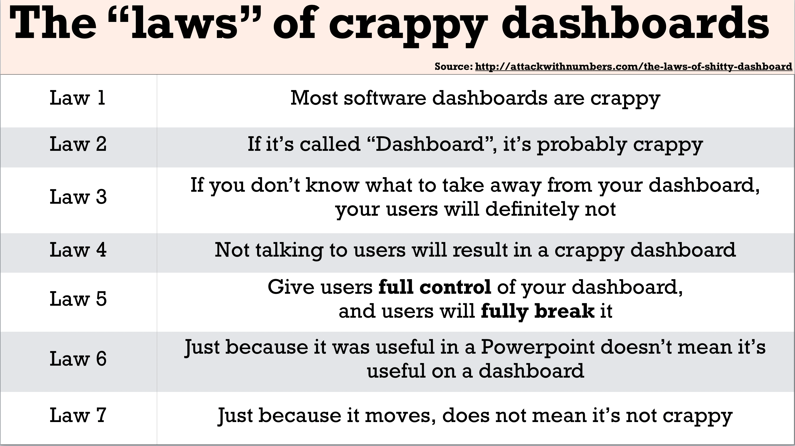
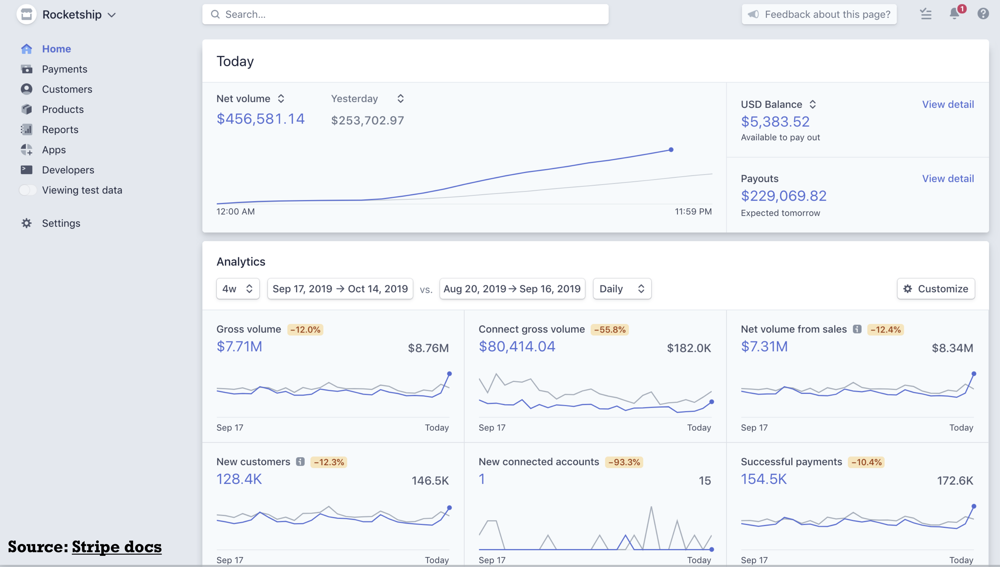
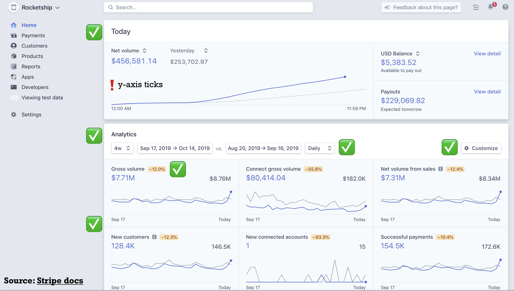

# (7) DashR: Part I

```{r include=FALSE}
knitr::opts_chunk$set(echo=TRUE, warning=FALSE, message=FALSE)
```

```{r}
library(tidyverse)
```

## Today's Agenda (10 mins)

- Announcements:
  - Zoom orientation
  - Online classes for the rest of the term
  - Adjustments to STAT 547M syllabus
  - Go over Milestone4

- Part 1: Introduction to Dashboards (15 mins)
  - Over the next 4 lectures, you will create ...
  - Purpose of Dashboards
  - Anatomy of a DashR app
  
- Part 2: Creating your first dashboard (45 mins)
  - Understanding Dash terminology
  - "Hello World" Dashboard
  - Adding components
  - ggplot and ggplotly

- Part 3: Summary and Review (10 mins)
  - Dash components and terminology
  - Go over Assignment 4
  
### Lecture Learning Objecives

By the end of this class you will : 

- have completed your first online class in STAT 547M!
- be able to explain elements of the Dash framework.
- be able to create a Dash app with several components.
- be able to describe principles of effective dashboards.

## Part 1: Introduction to Dashboards (15 mins)

Dashboards are an incredibly powerful and important tool for exploring data and trends.
In STAT547 we will talk briefly about what Dashboards are, and what they are used for but most of the lecture time will be focused on actually **making** dashboards, adding different elements, styling it, and deploying it so they are available publicly. 

Here is our plan for the next 2 weeks:

| Class | Key outcome |
|-------|--------------------|
| cm107 (today) | Introduction to Dash framework and creating your first app |
| cm108 | Linking Dash components using callbacks |
| cm109 | Layouts and multi-level callbacks | 
| cm110 | Styling dashboards | 

By the end of these four classes, you will be able to create this dashboard.

### Purpose of Dashboards

Before you build a dashbard, make sure it has a purpose!

Do not build one just for the sake of building one and contribute more noise!

Questions to ask yourself:

- What is the research or business question?
- Who will use it (audience matters, a lot!)?
- How long will they use it (one-time thing vs. continued use) ?
- Do you have time to build it, maintain it, and make it effective?
- Are there other dashboards that already exist that do the same thing?

This is what we're up against when creating dashboards:


Source: [Paul Cothenet](http://attackwithnumbers.com/the-laws-of-shitty-dashboard)'s blog post.

Here is what many consider in the industry to be a gold standard for dashboards.
We will step through several elements of the dashboard to understand why this dashboard is so effective.



And here is the annotated dashboard.


Source: [Stripe Docs](https://stripe.com/docs/dashboard)

Here is one more example of an effective dashboard:

[](https://fivethirtyeight.com/features/prison-reform-risk-assessment/#who-should-get-parole)

## Part 2: Creating your first dashboard (35 mins)

In the `cm107` participation folder, you should create a new file called `app.R`.
We will add to the app together during the lecture and by the end of the class, we should all have a functioning app.
Before we get to that, let's first get some terminology out of the way.
Below are notes that will be useful for you when creating your dashboards.

### Installing Dash

See the issue I created [here](https://github.com/STAT547-UBC-2019-20/Discussions/issues/35) for more details.
It may also be useful to check the [dash docs](https://dashr.plot.ly/installation) for more information on installing DashR.

### Understanding Dash terminology

- [`plot.ly`](https://plot.ly/graphing-libraries/) is both a company and an open source visualization library in python, R, and javascript (soon in Matlab and Julia).
- [`Dash`](https://dashr.plot.ly) is a Dashboard framework created by plot.ly that allows users to easily take their existing visualizations and make them interactive
- [`ggplotly`](https://plot.ly/ggplot2/) is both a package and a function that converts your ggplot2 figures into interactive ones powered by plotly.js, ready for embedding into Dash applications.

In Stat547, we will be creating Dash apps using ggplot2 objects.

Below are other major Dash-related packages.

#### Dash Core Components Package
- The `dashCoreCoponents` package includes dashboard components such as dropdown menus, tabs, sliders, and graphs.

- Some important core components are:

|Component Name|Description|
|--------------|-----------|
|`dccDropdown`|dropdown menu of values, with single or multiple value selection|
|`dccSlider`|one way slider of values, with one way value selection|
|`dccRangeSlider`|two way slider of values, with two way value selection|
|`dccChecklist`|list of values, with multiple value selection|
|`dccRadioItems`|list of values, with single value selection|
|`dccTabs`|tab, similar to a browser tab|
|`dccGraph`|Plotly graph|
|`dccMarkdown`|Markdown text, supports Markdown syntax|

- See [here](https://dashr.plot.ly/dash-core-components) for a comprehensive list of all Dash core components.

#### Dash HTML Components Package
- The `dashHtmlComponents` package includes components to format the layout of the dashboard and the text in the dashboard.
- Some important HTML components include:

|Component Name|Description|
|--------------|-----------|
|`htmlDiv`|dahsboard division|
|`htmlH1`|heading|
|`htmlLabel`|text|

- See [here](https://dashr.plot.ly/dash-html-components) for a comprehensive list of all Dash html components.

### Anatomy of a Dash app

Today we wil look at the minimum required elements to create a DashR dashboard.
There are 2 more elements that we will get to next lecture.


#### 1. Load required libraries and add documentation of what the app does

#### 2. Create instance of a Dash App

- `app <- Dash$new()` creates a new instance of a dash app

#### 3. Specify App Layout `app$layout()`

- `app$layout()` describes the layout of your app.
- An `htmlDiv` is placed inside an `app$layout()` call that allows you to specify where to add "Divs" in your dashboard. For example, create an area for plots, a header for a title, or a sidebar for filters. It also allows you to specify where in your dashboard to place your graphs and filters. We will look at these later in the layouts section ; for now, you will need just one div and specify Dash components using a list
- See [here](https://dashr.plot.ly/getting-started) for more information on Dash layouts.

#### 4. Run App

- `app$run_server()` runs your Dash app.
- Render your Dash app by running `$ Rscript app.R` in your terminal.
- Look at the output of your shell and navigate to the specified address (should be  http://127.0.0.1:8050/) in your web browser. You should see your dash app.
- Note: To automatically reload your dashboard when you make changes, add `debug=TRUE` to the `app$run_server` call.

### Create your first dash app

In the section below, paste the code from your app.R.
For participation today, you will need to create a functioning app.R and include it in your cm107 participation directory AND paste the code below.

This is all that is required from you today for participation marks.

```
## YOUR SOLUTION HERE

# author: YOUR NAME
# date: 2020-03-17

"This script is the main file that creates a Dash app.

Usage: app.R
"

# 1. Load libraries

# 2. Create Dash instance

# 3. Specify App layout

# 4. Run app
```

## Part 3: Summary and Review (10 mins)

### Dash components and terminology


### Go over Assignment 4

[Assignment 4](https://stat545.stat.ubc.ca/evaluation/assignment_04/assignment_04/) has been posted here. 