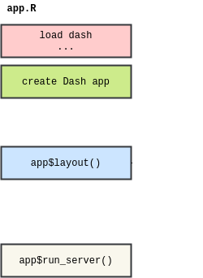
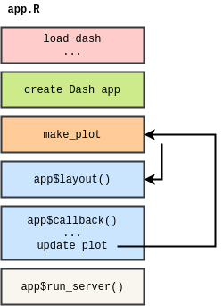

# (8) DashR: Part II

```{r include=FALSE}
knitr::opts_chunk$set(echo=TRUE, warning=FALSE, message=FALSE)
```

```{r}
library(tidyverse)
```

**This lecture is 95% completed.** I need to still explain a bit about quosures and then we're all set.

## Today's Agenda

- Announcements: (5 mins)
  - Reminder to [give anonymous feedback](https://firasmoosvi.typeform.com/to/KvvsII) on how things are going with online class
  - Please create an issue in our [`Discussion`](https://github.com/STAT547-UBC-2019-20/Discussions/issues) repo if you have questions!
  - Reminder about milestone04 and assignment04 
  - Go over [teamwork document](https://stat545.stat.ubc.ca/evaluation/teamwork/)

- Part 1: Review of Dash app (5 mins)
  - Demo from cm107: adding a ggplot object
  - Basic Dash anatomy
  
- Part 2: Organizing your Dash app (20 mins)
  - Make Plot
  - Assign components to variables

- Part 3: Callbacks in Dash (45 mins)
  - Template App
  - Interlude: `!!sym()` syntax
  - Call backs in Dash

- Part 4: Bonus/Optional - Change the scale of the y-axis using a button

## Part 1: Review of Dash app (5 mins)

Let's make sure everyone is on the same page about the [last demo from cm107](https://repl.it/join/lxplstfb-firasm): a ggplot graph inside a Dash app.

Last time we looked at this schematic as a bare-bones skeleton of a Dash app.



A few things were left out, here they are now:



Roughly corresponding to the above, here is a full template of a DashR app:

```
# author: YOUR NAME
# date: THE DATE

"This script is the main file that creates a Dash app.

Usage: app.R
"

## Load libraries

## Make plot

## Assign components to variables

## Create Dash instance

app <- Dash$new()

## Specify App layout

app$layout(
  htmlDiv(
    list(
      ### Add components here
    )
  )
)

## App Callbacks

## Update Plot

## Run app

app$run_server(debug=TRUE)

# command to add dash app in Rstudio viewer:
# rstudioapi::viewer("http://127.0.0.1:8050")

```

I have also created a template on [repl.it](https://repl.it/@firasm/apptemplateR) that you can fork.
I will update this template as we learn new things (like callbacks and layouts)

## Part 2: Organizing your Dash app (20 mins)

Today we will look at a complete dash app. 
But before we get there, we need to do a bit more housekeeping:

**The following two subsections should be updated in the `app.R` file of cm107!!**

### (**NEW**) Make Plot

- To make your app more organized, you may optionally create a function that outputs a ggplot object
- We will call this function `make_plot` to be consistent, but it can be called anything and there can even be multiple functions.
- The input arguments of the `make_plot` function will be the features that the user can filter or select for.
- The `make_plot` function will filter the data based on the provided input arguments and ouput a plot based on the filtered data.

For example, let's turn the creation of a plot in [last demo from cm107](https://repl.it/join/lxplstfb-firasm) into a function (`make_plot`) that outputs a ggplotly object:

```
## YOUR SOLUTION HERE

make_plot <- function() {
	# add a ggplot
	plot <- mtcars %>% 
		ggplot() + 
		theme_bw() +
		geom_point(aes(x = mpg, y = hp) ) + 
		labs(x = 'Fuel efficiency (mpg)',
				 y = 'Horsepower (hp)') + 
		ggtitle(("Horsepower and Fuel efficiency for "))
	
	ggplotly(plot)
}
```

### (**NEW**) Assign components to variables

In order to keep `app$layout()` relatively clean, tidy, and easy to debug, I recommend you create your components as variables first and then pass those into the list of `app$layout()`.

For example:

```
## YOUR SOLUTION HERE

# Assign components to variables
heading_helloworld = htmlH1('Hello world!! Dash application')
heading_subtitle = htmlH2('This is a subheading')
graph_1 = dccGraph(id='mtcars',figure = make_plot())

# Specify App layout
app$layout(
	htmlDiv(
		list(
			heading_helloworld,
			heading_subtitle,
			graph_1
		)
	)
)
```

## Part 3: Callbacks in Dash (45 mins)

So far, you've learnt how to create Dash core components (ex. dropdown menu filter) and plots. 
Let's (finally) now try to link those two things, and interactively update our plots based on the user selection. 

To do so, we are going to use what are called `callbacks`. 

### Today's app : Dynamically update a plot with a dropdown menu

First, copy the following code in a new R file named `app.R`.

**Step 0 : create the app**

```{app.R_template}
# author: YOUR NAME
# date: THE DATE

"This script is the main file that creates a Dash app for cm108 on the gapminder dataset.

Usage: app.R
"

## Load libraries
library(dash)
library(dashCoreComponents)
library(dashHtmlComponents)
library(dashTable)
library(tidyverse)
library(plotly)
library(gapminder)

## Make plot

make_plot <- function(){
	
	# gets the label matching the column value
	
	#filter our data based on the year/continent selections
	data <- gapminder
	p <- ggplot(data, aes(x = year, y = gdpPercap, colour = continent,
												text = paste('continent: ', continent,
																		 '</br></br></br> Year:', year,
																		 '</br></br> GDP:', gdpPercap))) +
		geom_jitter(alpha = 0.6) +
		scale_color_manual(name = 'Continent', values = continent_colors) +
		scale_x_continuous(breaks = unique(data$year))+
		xlab("Year") +
		ylab("GDP Per Capita") +
		ggtitle("Change in <<VARIBALE>> over time") +
		theme_bw()
	
	# passing c("text") into tooltip only shows the contents of the "text" aesthetic specified above
	ggplotly(p, 
					 tooltip = c("text"))
}

## Assign components to variables

heading_title <- htmlH1('Gapminder Dash Demo')
heading_subtitle <- htmlH2('Looking at country data interactively')

# Storing the labels/values as a tibble means we can use this both 
# to create the dropdown and convert colnames -> labels when plotting
yaxisKey <- tibble(label = c("GDP Per Capita", "Life Expectancy", "Population"),
									 value = c("gdpPercap", "lifeExp", "pop"))
#Create the dropdown
yaxisDropdown <- dccDropdown(
	id = "y-axis",
	options = map(
		1:nrow(yaxisKey), function(i){
			list(label=yaxisKey$label[i], value=yaxisKey$value[i])
		}),
	value = "gdpPercap"
)

graph <- dccGraph(
	id = 'gap-graph',
	figure=make_plot() # gets initial data using argument defaults
)

sources <- dccMarkdown("[Data Source](https://cran.r-project.org/web/packages/gapminder/README.html)")

## Create Dash instance

app <- Dash$new()

## Specify App layout

app$layout(
	htmlDiv(
		list(
			heading_title,
			heading_subtitle,
			#selection components
			htmlLabel('Select y-axis metric:'),
			yaxisDropdown,
			#graph and table
			graph,
			htmlIframe(height=20, width=10, style=list(borderWidth = 0)), #space
			sources
		)
	)
)

## App Callbacks

## Update Plot

## Run app

app$run_server(debug=TRUE)

# command to add dash app in Rstudio viewer:
# rstudioapi::viewer("http://127.0.0.1:8050")
```

We will walk through the "new elements" of this app:

1. `text` aesthetic in ggplot ([ref here](https://stackoverflow.com/a/43763132)) is useful for specifying what's in the tooltips (applicable to ggplotly objects only)

1. Use of htmlIframe to add some space between Dash components
  - This is a bit of a hack until next week when we get to layouts in Dash
  - For now, this bit of code adds an empty space 20px x 10px with no border:
  `htmlIframe(height=20, width=10, style=list(borderWidth = 0))`
  
1. Specifying Dropdown options using map (rather than listing out each of them one by one):
  - Admittedly, this doesn't save us much time here, but you can imagine how much time/space it would save if you had more than 5 items in the dropdown


```{r}
yaxisKey <- tibble(label = c("New York City", "Montreal", "San Francisco"),
									 value = c("NYC", "MTL", "SF"))

map(
		1:nrow(yaxisKey), function(i){
			list(label=yaxisKey$label[i], value=yaxisKey$value[i])
		})
```

To run this code, run `Rscript app.R` in your terminal from the folder where your `app.R` is.

This script creates an app to analyze the gapminder dataset. 
It contains a dropdown menu with different values for the y-axis, and a scatter plot - but these are not yet LINKED to the plot! We will do that now

Let's now try to link the dropdown menu and the plot, so that the y-axis of the plot is the value selected from the dropdown menu. 

**Step 1 : Update the `make_plot()` function **

The first thing we have to do is to specify in our `make_plot()` function that the name of the y-axis is going to be an input. 
We also need to update the function so that the graph depends on the value of this input.
Try to make all the changes that you think necessary so that the plot depends on the value of the input `yaxis`. You can set 'gdpPercap' as the default value. Make sure that the title of the plot depends on the input too.

### Interlude: `!!sym()` syntax


### Back to regularly scheduled programming: Updating make_plot()

```{make_plot_answer}
## YOUR SOLUTION HERE
make_plot <- function(yaxis = "gdpPercap"){
  
  # gets the label matching the column value
  y_label <- yaxisKey$label[yaxisKey$value==yaxis]
  
  #filter our data based on the year/continent selections
  data <- gapminder
  # make the plot!
  # on converting yaxis string to col reference (quosure) by `!!sym()`
  # see: https://github.com/r-lib/rlang/issues/116#issuecomment-298969559
  #
  # `sym()` turns strings (or list of strings) to symbols (https://www.rdocumentation.org/packages/rlang/versions/0.2.2/topics/sym)
  #
  # `paste` concatenates vectors after converting to characters (https://www.rdocumentation.org/packages/base/versions/3.6.1/topics/paste)
  
  p <- ggplot(data, aes(x = year, y = !!sym(yaxis), colour = continent,
                        text = paste('continent: ', continent,
                                     '</br></br></br> Year:', year,
                                     '</br></br> GDP:', gdpPercap))) +
    geom_jitter(alpha = 0.6) +
    scale_color_manual(name = 'Continent', values = continent_colors) +
    scale_x_continuous(breaks = unique(data$year))+
    xlab("Year") +
    ylab(y_label) +
    ggtitle(paste0("Change in ", y_label, " Over Time")) +
    theme_bw()
  
  # passing c("text") into tooltip only shows the contents of 
  ggplotly(p, tooltip = c("text"))
}
```
Now that we changed the function that creates the graph so that it takes a value of the y-axis as an input, we have to link the two dash components that we have : the graph and the dropdown menu. This is when you create the callback! 

### Callbacks

Callbacks are chunks of code that you are going to put :

- after you created your layout (that contains your plots, your dropdown menus,...)

- before you run your application (so before the `app$run_server()` line)

Callbacks usually have the following structure : 

```
app$callback(
  #What you want to update 
  output=list(id = <element_id>, property= <element_type>),
  #Based on the following values
  params=list(input(id = '<value_1>', property='value'),
              input(id = '<value_2>', property='value'),
              input(id = '<value_3>', property='value')),
  #translate your list of params into function arguments
  function(<value_1>, <value_2>, <value_3>) {
    my_function(<value_1>, <value_2>, <value_3>)
  })
```
The angle brackets mean that you have to change those names into the ones that corresponds to the elements of your app. 

The way callbacks work is the following : Dash is going to use the inputs that are in the `params` list as the inputs of the `function` in order to change the property of the Dash component that are specified in the `output` argument.

I gave you the general structure of a callback so that you can see what it looks like. Let's now use an example to understand better how to specify callbacks. In our example, we are going to change what variable is used as the y-axis of a graph by using a dropdown menu.

**Step 2 : create the callback**

**Step 2.1 : define the output of the callback**

If we look back at the general structure of a callback, we can see that the first thing we have to define is the element we want to update : this is the output of the callback.

Try to fill up the blanks : 

```{output_question}
output=list(id = <element_id>, property= <element_type>)

## YOUR SOLUTION HERE
output=list(id = 'gap-graph', property= 'figure')
```

The required parameter `id` 'gap-graph' is the id of the component you want to display (look where `graph <-` is defined in the template of the code above). 
The optional parameter `property` argument refers to which property of your component you want to display.

**Step 2.2 : define the input(s) of the callback**

Then, we have to define our parameters, which are the values we are going to use as an input of our callback to update our graph.

Try to  fill in the blanks : 

```{params_question}
params=list(input(id = '<value_1>', property='value')),

## YOUR SOLUTION HERE
params=list(input(id = 'y-axis', property='value')),
```

The way to read this code is the same as before : our input is the "value" property of the component that has the ID "y-axis" (look where `yaxisDropdown <-` is defined above in the template).

**Step 2.3 : define the function in the callback**

Finally, we just have translate our list of params into a function arguments.

Try to fill in the blanks : 

```{function_question}
  function(<value_1>) {
    my_function(<value_1>)
  }

## YOUR SOLUTION HERE
  function(yaxis_value) {
    make_plot(yaxis_value)
}
```

Notice that we have never defined `yaxis_value` before, this is just the name that I decided to give to the input of my function. What is important here is that the argument of your function has the same name as the argument you put inside the `make_plot()` function. 

If we gather all those answers, we obtain the complete callback : 

```{callback}
app$callback(
  #update figure of gap-graph
  output=list(id = 'gap-graph', property='figure'),
  #based on values of year, continent, y-axis components
  params=list(input(id = 'y-axis', property='value')),
  #this translates your list of params into function arguments
  function(yaxis_value) {
    make_plot(yaxis_value)
  })
```

What is happening here?
Well, see that Dash takes the input property (the 'value' of the 'y-axis' component), uses it as an input argument of the function, and updates the property of the output component (the 'figure' of the 'gap-graph' component) with whatever was returned by the function!
So cool!

**Step 3 : Put it all together!**

Now, add this chunck of code in your app after your app layout under the section heading `## App Callbacks`. 

You should have the following code : 

```{app_1}
library(dash)
library(dashCoreComponents)
library(dashHtmlComponents)
library(dashTable)
library(tidyverse)
library(plotly)
library(gapminder)
app <- Dash$new(external_stylesheets = "https://codepen.io/chriddyp/pen/bWLwgP.css")
# Storing the labels/values as a tibble means we can use this both 
# to create the dropdown and convert colnames -> labels when plotting
yaxisKey <- tibble(label = c("GDP Per Capita", "Life Expectancy", "Population"),
                   value = c("gdpPercap", "lifeExp", "pop"))
#Create the dropdown
yaxisDropdown <- dccDropdown(
  id = "y-axis",
  options = map(
    1:nrow(yaxisKey), function(i){
      list(label=yaxisKey$label[i], value=yaxisKey$value[i])
    }),
  value = "gdpPercap"
)
# Use a function make_plot() to create the graph
make_plot <- function(yaxis = "gdpPercap"){
  
  # gets the label matching the column value
  y_label <- yaxisKey$label[yaxisKey$value==yaxis]
  
  #filter our data based on the year/continent selections
  data <- gapminder
  # make the plot!
  # on converting yaxis string to col reference (quosure) by `!!sym()`
  # see: https://github.com/r-lib/rlang/issues/116#issuecomment-298969559
  #
  # `sym()` turns strings (or list of strings) to symbols (https://www.rdocumentation.org/packages/rlang/versions/0.2.2/topics/sym)
  #
  # `paste` concatenates vectors after converting to characters (https://www.rdocumentation.org/packages/base/versions/3.6.1/topics/paste)
  
  p <- ggplot(data, aes(x = year, y = !!sym(yaxis), colour = continent,
                        text = paste('continent: ', continent,
                                     '</br></br></br> Year:', year,
                                     '</br></br></br> GDP:', gdpPercap))) +
    geom_jitter(alpha = 0.6) +
    scale_color_manual(name = 'Continent', values = continent_colors) +
    scale_x_continuous(breaks = unique(data$year))+
    xlab("Year") +
    ylab(y_label) +
    ggtitle(paste0("Change in ", y_label, " Over Time")) +
    theme_bw()
  
  # passing c("text") into tooltip only shows the contents of 
  ggplotly(p, tooltip = c("text"))
}
# Now we define the graph as a dash component using generated figure
graph <- dccGraph(
  id = 'gap-graph',
  figure=make_plot() # gets initial data using argument defaults
)
app$layout(
  htmlDiv(
    list(
      htmlH1('Gapminder Dash Demo'),
      htmlH2('Looking at country data interactively'),
      #selection components
      htmlLabel('Select y-axis metric:'),
      yaxisDropdown,
      #graph and table
      graph,
      htmlIframe(height=20, width=10, style=list(borderWidth = 0)), #space
      dccMarkdown("[Data Source](https://cran.r-project.org/web/packages/gapminder/README.html)")
    )
  )
)
app$callback(
  #update figure of gap-graph
  output=list(id = 'gap-graph', property='figure'),
  #based on values of year, continent, y-axis components
  params=list(input(id = 'y-axis', property='value')),
  #this translates your list of params into function arguments
  function(yaxis_value) {
    make_plot(yaxis_value)
  })
app$run_server()
```

Run this app, and try to play with the dropdown menu!
You can see that what is displayed by the graph on the y-axis depends on the value you choose on your dropdown menu. 

Congratulations, you just did your first callback and a "real" dashboard!!!

## Part 4: BONUS/OPTIONAL (if you want extra practice!) : Change the scale of the y-axis using a button

Now, let's do another exercise : add a button to specify if we want the scale of the y-axis to be linear or logarithmic.


**Step 0 : Create the button and add it to the list in `app$layout`**

Try to add a button with 2 choices : `Linear` and `Log`

Here is the code for the button component:

```
#Create the button 
logbutton <- dccRadioItems(
          id = 'yaxis-type',
          options = list(list(label = 'Linear', value = 'linear'),
                         list(label = 'Log', value = 'log')),
          value = 'linear'
)
```

**Step 1 : Update the `make_plot()` function**

Update the `make_plot()` function so that one of its arguments changes the scale of the y-axis.

```{answer_make_plot_button}

## YOUR SOLUTION HERE
make_plot <- function(yaxis = "gdpPercap", scale = "linear"){
  
  # gets the label matching the column value
  y_label <- yaxisKey$label[yaxisKey$value==yaxis]
  
  #filter our data based on the year/continent selections
  data <- gapminder
  p <- ggplot(data, aes(x = year, y = !!sym(yaxis), colour = continent,
                        text = paste('continent: ', continent,
                                     '</br></br></br> Year:', year,
                                     '</br></br> GDP:', gdpPercap))) +
    geom_jitter(alpha = 0.6) +
    scale_color_manual(name = 'Continent', values = continent_colors) +
    scale_x_continuous(breaks = unique(data$year))+
    xlab("Year") +
    ylab(y_label) +
    ggtitle(paste0("Change in ", y_label, " over time (Scale : ", scale, ")")) +
    theme_bw()
  
  if (scale == 'log'){
    p <- p + scale_y_continuous(trans='log10')
  }
  
  # passing c("text") into tooltip only shows the contents of 
  ggplotly(p, tooltip = c("text"))
}
```

**Step 2 : Create the callback**

Now, it's time to create the callback!

*Hint* : As the Dash component you have to update is the same as the one we updated in Exercise 1, so you can use the same callback as before and just add another variable as part of the input. 

```{answer_callback_button}
## YOUR SOLUTION HERE
app$callback(
  #update figure of gap-graph
  output=list(id = 'gap-graph', property='figure'),
  #based on values of year, continent, y-axis components
  params=list(input(id = 'y-axis', property='value'),
              input(id = 'yaxis-type', property='value')),
  #this translates your list of params into function arguments
  function(yaxis_value, yaxis_scale) {
    make_plot(yaxis_value, yaxis_scale)
  })
```

**Step 3 : put it all togheter**

Now, gather all your chunks of code. Your final answer should be similar to this : 

```{answer_code_with_button}
# author: YOUR NAME
# date: THE DATE

"This script is the main file that creates a Dash app for cm108 on the gapminder dataset.

Usage: app.R
"

## Load libraries
library(dash)
library(dashCoreComponents)
library(dashHtmlComponents)
library(dashTable)
library(tidyverse)
library(plotly)
library(gapminder)

## Make plot

make_plot <- function(yaxis = "gdpPercap",
											scale = "linear"){
	
	# gets the label matching the column value
	y_label <- yaxisKey$label[yaxisKey$value==yaxis]
	
	#filter our data based on the year/continent selections
	data <- gapminder
	# make the plot!
	# on converting yaxis string to col reference (quosure) by `!!sym()`
	# see: https://github.com/r-lib/rlang/issues/116#issuecomment-298969559
	#
	# `sym()` turns strings (or list of strings) to symbols (https://www.rdocumentation.org/packages/rlang/versions/0.2.2/topics/sym)
	#
	# `paste` concatenates vectors after converting to characters (https://www.rdocumentation.org/packages/base/versions/3.6.1/topics/paste)
	
	p <- ggplot(data, aes(x = year, y = !!sym(yaxis), colour = continent,
												text = paste('continent: ', continent,
																		 '</br></br></br> Year:', year,
																		 '</br></br>GDP:', gdpPercap))) +
		geom_jitter(alpha = 0.6) +
		scale_color_manual(name = 'Continent', values = continent_colors) +
		scale_x_continuous(breaks = unique(data$year))+
		xlab("Year") +
		ylab(y_label) +
		ggtitle(paste0("Change in ", y_label, " over time (Scale : ", scale, ")")) +
		theme_bw()
	
	if (scale == 'log'){
		p <- p + scale_y_continuous(trans='log10')
	}
	# passing c("text") into tooltip only shows the contents of 
	ggplotly(p, tooltip = c("text"))
}

## Assign components to variables

heading_title <- htmlH1('Gapminder Dash Demo')
heading_subtitle <- htmlH2('Looking at country data interactively')

# Storing the labels/values as a tibble means we can use this both 
# to create the dropdown and convert colnames -> labels when plotting
yaxisKey <- tibble(label = c("GDP Per Capita", "Life Expectancy", "Population"),
									 value = c("gdpPercap", "lifeExp", "pop"))
#Create the dropdown
yaxisDropdown <- dccDropdown(
	id = "y-axis",
	options = map(
		1:nrow(yaxisKey), function(i){
			list(label=yaxisKey$label[i], value=yaxisKey$value[i])
		}),
	value = "gdpPercap"
)

#Create the button 
logbutton <- dccRadioItems(
	id = 'yaxis-type',
	options = list(list(label = 'Linear', value = 'linear'),
								 list(label = 'Log', value = 'log')),
	value = 'linear'
)

graph <- dccGraph(
	id = 'gap-graph',
	figure=make_plot() # gets initial data using argument defaults
)

sources <- dccMarkdown("[Data Source](https://cran.r-project.org/web/packages/gapminder/README.html)")

## Create Dash instance

app <- Dash$new()

## Specify App layout

app$layout(
	htmlDiv(
		list(
			heading_title,
			heading_subtitle,
			#selection components
			htmlLabel('Select y-axis metric:'),
			yaxisDropdown,
			htmlIframe(height=15, width=10, style=list(borderWidth = 0)), #space
			htmlLabel('Select y scale : '),
			logbutton,
			#graph
			graph,
			htmlIframe(height=20, width=10, style=list(borderWidth = 0)), #space
			sources
		)
	)
)

## App Callbacks

app$callback(
	#update figure of gap-graph
	output=list(id = 'gap-graph', property='figure'),
	#based on values of year, continent, y-axis components
	params=list(input(id = 'y-axis', property='value'),
							input(id = 'yaxis-type', property='value')),
	#this translates your list of params into function arguments
	function(yaxis_value, yaxis_scale) {
		make_plot(yaxis_value, yaxis_scale)
	})

## Run app

app$run_server(debug=TRUE)

# command to add dash app in Rstudio viewer:
# rstudioapi::viewer("http://127.0.0.1:8050")
```

Finally, try to run your app to make sure everything works.

Now you know how to add multiple callbacks! 

For the second part of this lecture, we are going to go one level up : it's time to deal with more complex callbacks!! 

## Appendix: Anatomy of a full Dash app

#### Load libraries & documentation

Documentation goes first inside double quotes " " and should include a Usage line of just app.R.
Libraries are then loaded.

#### (**NEW**) Make Plot

- To make your app more organized, you may optionally create a function that outputs a ggplot object
- We will call this function `make_plot` to be consistent, but it can be called anything and there can even be multiple functions.
- The input arguments of the `make_plot` function will be the features that the user can filter or select for.
- The `make_plot` function will filter the data based on the provided input arguments and ouput a plot based on the filtered data.

For example, let's turn the creation of a plot in [last demo from cm107](https://repl.it/join/lxplstfb-firasm) into a function (`make_plot`) that outputs a ggplotly object:

```
## YOUR SOLUTION HERE

make_plot <- function() {
	# add a ggplot
	plot <- mtcars %>% 
		ggplot() + 
		theme_bw() +
		geom_point(aes(x = mpg, y = hp) ) + 
		labs(x = 'Fuel efficiency (mpg)',
				 y = 'Horsepower (hp)') + 
		ggtitle(("Horsepower and Fuel efficiency for "))
	
	ggplotly(plot)
}
```

#### Create Dash instance

- `app <- Dash$new()` creates a new instance of a dash app

#### (**NEW**) Assign components to variables

In order to keep `app$layout()` relatively clean, tidy, and easy to debug, I recommend you create your components as variables first and then pass those into the list of `app$layout()`.

For example:

```
# Assign components to variables
heading_helloworld = htmlH1('Hello world!! Dash application')
heading_subtitle = htmlH2('This is a subheading')
graph_1 = dccGraph(id='mtcars',figure = make_plot())

# Specify App layout
app$layout(
	htmlDiv(
		list(
			heading_helloworld,
			heading_subtitle,
			graph_1
		)
	)
)
```

#### Specify App Layout `app$layout()`

- `app$layout()` describes the layout of your app.
- An `htmlDiv` is placed inside an `app$layout()` call that allows you to specify where to add "Divs" in your dashboard. For example, create an area for plots, a header for a title, or a sidebar for filters. It also allows you to specify where in your dashboard to place your graphs and filters. We will look at these later in the layouts section ; for now, you will need just one div and specify Dash components using a list
- See [here](https://dashr.plot.ly/getting-started) for more information on Dash layouts.

#### (**NEW**) App Callbacks `app$callback()`

- `app$callback()` allows you to use Dash components (ex. dropdown menus) to interactively change your plots (or other components).
- `app$callback()` can also be used to filter your data, or do other things that control the data going into your plots.

\newline

- See [here](https://dashr.plot.ly/getting-started-part-2) for more information on Dash callbacks.

#### Run App

- `app$run_server()` runs your Dash app.
- Render your Dash app by running `$ Rscript app.R` in your terminal.
- Look at the output of your shell and navigate to the specified address (should be  http://127.0.0.1:8050/) in your web browser. You should see your dash app.
- Note: To automatically reload your dashboard when you make changes, add `debug=TRUE` to the `app$run_server` call.