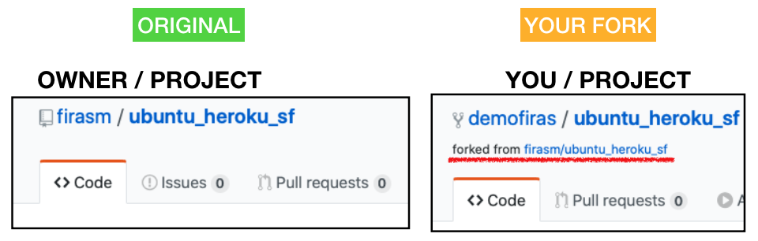

# About This Guide {-}

Placeholder


## Other Contributors {-}

<!--chapter:end:index.Rmd-->


# Introduction to STAT 545 and GitHub

Placeholder


## Outline
## Learning Objectives
## Resources
## Topic 1: Syllabus (20 min)
## Topic 2: GitHub (35 min)
### Register a GitHub account - Activity (4 min)
### GitHub as cloud storage (4 min)
### GitHub as cloud storage - Activity (10 min)
### GitHub for collaboration (4 min)
### GitHub for collaboration - Activity (1 min)
### GitHub for version control with git (5 min)
### GitHub for version control with git - Activity (5 min)
## Topic 3: Asking effective questions online (10 min)
### Asking questions - Activity (5 min)
## To do before next class
### Software Stack Installation

<!--chapter:end:cm001.Rmd-->


# Introduction to R

Placeholder


## Learning Objectives
## Participation
## Resources
## Why R?
## Orientation to R
### Using R and RStudio (5 min)
### Vectors (3 min)
### Functions, Part I (3 min)
### Comparisons (7 min)
### Subsetting (10 min)
### NA (2 min)
### Functions, Part II (10 min)
### Data frames (12 min)
### R packages (13 min)
### Two slogans to understand computations in R (6 min)
## Finishing up (5 min)

<!--chapter:end:cm002.Rmd-->


# Authoring

Placeholder


## Learning Objectives
## Resources
## Topic 1: Output Formats (5 min)
## Topic 2: Markdown
### Activity: Modify `navigating_github.md` (5 min)
### Activity: Render `navigating_github.md` (5 min)
## Topic 3: R Markdown
### Activity: getting set up with R packages (5 min)
### Activity: exploring code chunks (15 min)
### Activity: exploring the YAML header (10 min)
### Activity: exploring chunk options (5 min)
## Topic 4: Rmd Presentations
### Activity: exploring ioslides (10 min)
## Wrap-up (3 min)

<!--chapter:end:cm003.Rmd-->


# The version control workflow

Placeholder


## Learning Objectives
## Working with git and GitHub
### Preliminary: configuring git (3 min)
### The typical workflow (8 min)
### The typical workflow: Activity (5 min)
### Git Clients (3 min)
### Merge conflicts (5 min)
### Merge conflicts: Activity (5 min)
### Branching (8 min)
### Branching: Activity (5 min)
### Undoing Changes (5 min)
### Undoing Changes: Activity (2 min)
### Getting errors? (3 min)
### Tagging a Release (5 min)
### Tagging a Release: Activity (3 min)

<!--chapter:end:cm004.Rmd-->


# Intro to plotting with `ggplot2`, Part I

Placeholder


## Learning Objectives
## Resources (2 min)
## Orientation to plotting in R (7 min)
## Just plot it (7 min)
## The grammar of graphics (15 min)
### Example: Scatterplot grammar
### Activity: Bar chart grammar
## Working with `ggplot2` (40 min)
### Activity: Plotting

<!--chapter:end:cm005.Rmd-->


# Intro to data wrangling, Part I

Placeholder


## Today's Lessons
## Resources
## Participation
## Intro to `dplyr` syntax
### Learning Objectives
### Preamble
### Demonstration
## Small break
## The `dplyr` advantage
### Learning Objectives
### Compare base R to `dplyr`
## Relational/Comparison and Logical Operators in R
### Learning Objectives
### R Operators
### Demonstration
## If there's time remaining

<!--chapter:end:cm006.Rmd-->


# Intro to data wrangling, Part II

Placeholder


## Orientation (5 min)
### Worksheet
### Announcements
### Follow-up
### Today's Lessons
### Resources
## `summarize()` (3 min)
## `group_by()` (20 min)
### Grouped `summarize()` (10 min)
### Grouped `mutate()` (3 min)
## Function types (5 min)
## `dplyr` Exercises (20 min)
## Dates and Times (5 min)
## Tsibbles (15 min)
### `index_by()` instead of `group_by()` (5 min)

<!--chapter:end:cm007.Rmd-->


# Intro to plotting with `ggplot2`, Part II

Placeholder


## Orientation
### Worksheet
### Announcements
### Today 
## Participation repository and GitHub Pages (15 min)
### GitHub Pages
### Practice with HTML file linking
## A tour of some important `geom`s (20 min)
### Histograms: `geom_histogram()`
### Density: `geom_density()`
### Jitter plots: `geom_jitter()`
### Box plots: `geom_boxplot()`
### Ridge plots: `ggridges::geom_density_ridges()`
### Bar plots: `geom_bar()` or `geom_col()`
### Line charts: `geom_line()`
### Path plots: `geom_path()`
## Activity: Fix the Plots (40 min)
## Time remaining?

<!--chapter:end:cm008.Rmd-->


# Tidy Data and Pivoting

Placeholder


## Orientation (5 min)
### Worksheet
### Announcements
### Today
### Resources
## Tidy Data (10 min)
### Untidy Examples
### Pivoting tools
## Univariate Pivoting (20 min)
### `pivot_longer()`
### `pivot_wider()`
### Activity
## Multivariate Pivoting (20 min)
### `pivot_longer()`
### `pivot_wider()`
### Activity
## Making tibbles (5 min)
## Implicit `NA`'s (5 min)
## Activity (10 min)

<!--chapter:end:cm009.Rmd-->


# Tibble Joins

Placeholder


## Worksheet
## Resources
## Join Functions (25 min)
## Activity (25 min)
## Time remaining?

<!--chapter:end:cm010.Rmd-->


# File input/output (I/O)

Placeholder


## Worksheet
## Resources
### References and tutorials
### Package documentation
## Writing data to disk (10 mins)
## Making the case for here::here()
## Reading data from disk (5 mins)
## Import a file from the web/cloud
### Import a csv file from the internet
### Import an excel file (.xls) from the internet
## Read in a sample Excel file. (Optional)

<!--chapter:end:cm011.Rmd-->


# Working with factors in R

Placeholder


## Worksheet
## Resources
### References and tutorials
### Package documentation
## Recap of CM011
## Motivating the need for factors in R
### Activity 1: Using Factors for plotting 
## Inspecting factors (activity 2)
### Exploring `gapminder$continent` (activity 2.1)
### Exploring `gapminder$country` (activity 2.2)
## Dropping unused levels
## Changing the order of levels
## Change order of the levels manually
### Recoding factors
## Grow a factor (OPTIONAL)

<!--chapter:end:cm012.Rmd-->


# Effective Visualizations

Placeholder


## Worksheet
## Resources
## Part 1: Warm-up and pre-test [20 mins]
### Warmup:
### CQ01: Weekly hours for full-time employees
### CQ02: Average Global Temperature by year
### CQ03: Gun deaths in Florida
## Part 2: Extracting insight from visualizations  [20 mins]
## Part 3: Principles of effective visualizations [20 mins]
### Make a great plot worse
## Plotly demo [10 mins]
### Make `ggplot2` graphs interactive
### Make interactive plots with `plotly::plot_ly`
### Share with others
## Supplemental worksheet (Optional)

<!--chapter:end:cm013.Rmd-->


# The Model-Fitting Paradigm in R

Placeholder


## Today
## Recap: principles of effective visualizations
## Resources
## Introduction and motivation for model-fitting in R.
## Instructor and TA evaluations
## Break
## Worksheet
## Deep Thoughts about Data Analytic Work
### Reproducibility
### Coding Practices: Naming
### Coding Practices: Documenting code 
### Coding Practices: The DRY principle
### Coding Practices: Style Guides

<!--chapter:end:cm014.Rmd-->

# STAT 547M {-}

STAT 547 is under active development. The materials will be updated evry week prior to the class.

<!--chapter:end:cm100.Rmd-->


# (1) Review of STAT 545 

Placeholder


## Today's Agenda
## Part 1: Introductions and course overview (15 mins)
### Important links
### Course structure
### Office hours and optional "lab"
### Auditing students
## Part 2: Group projects in STAT 547
### Partners
### Milestone 1
## Part 3: Review of STAT545 (45 mins)
## Participation worksheet
### Introduction
### The Tidyverse {#tidyverse}
### Learning Objectives
### How do I read data?
### How do I inspect data?
### How do I index rows and columns?
### How do I calculate basic statistics?
### How do I filter data?
### How do I write tidy code?
### How do I model my data?
### How do I create a plot?
### Do I need more practice with the tidyverse?
### Key Points

<!--chapter:end:cm101.Rmd-->

# (2) Git workflows

```{r, include=FALSE}
knitr::opts_chunk$set(echo=TRUE, warning=FALSE, message=FALSE)
```

```{r,}
library(tidyverse)
install.packages('tictoc') # you might need to install this new package: install.packages('tictoc')
library(tictoc) 
library(datasets)
library(glue)
```

## Today's Agenda

- Announcements:
  - Reminder about Assignment 1 and milestone 1 due on Saturday at 6 PM
  - By now you should have already gotten in touch with your partner. If you are having troubles, please send me a private message on canvas
  - If you would like someone from the teaching team to approve your dataset, please create an issue [here](https://github.com/STAT547-UBC-2019-20/Discussions/issues)

- Part 1: Git and GitHub for collaborative work (20 mins)
  - Sensible workflow for local work
  - Setting up your project repositories
  - Dealing with merge conflicts
  
- Part 2: More about fork and clone workflow

## Part 1: Git and GitHub for collaborative work

- Git class demo with Firas & Yulia
- Class activity with your partner 
    - Try to sit with your project partner
    - If you are auditing the course, try to find another who is so you can do this part with someone else
- Tips and tricks on how to handle merge conflicts.

### Create your project repo and add your partner as admin

1. Go to the [STAT547 - Spring 2020 organization](https://github.com/STAT547-UBC-2019-20/)
2. On the right of the page, click the green "New" button
3. For the repository name, set it to "group_xx_yy" where xx is your group number (from canvas) and yy is an optional name of your repo
4. Keep this repo private (for now)
5. Initialize the repo with a README, add a .gitignore file (for R) and a license (MIT is fine).
6. Once at the home page of your repo, click "Settings", then "Manage Access"
7. Add your team member, and give them Admin access.
7. THERE IS NO NEED TO add any of the teaching team to your repo, we will have access as long as it's created inside the STAT547 organization.

### Setup your local directories, and RStudio to work nicely with GitHub

1. Locally on my machine, create a new folder called stat547 in a sensible place: <SENSIBLE_PATH>
2. Create folders for each of your main areas: `Discussion`, `assignments`, `project`, `participation`
3. On GitHub.com visit each of these repositories and copy the git repo URL into these spots
	- `Discussion`: https://github.com/STAT547-UBC-2019-20/Discussions.git
	- `assignment_01`: ## LINK TO THIS REPO
	- `participation`: ## LINK TO THIS REPO
4. Create a new RStudio project for each of the repos above
	- Open RStudio then click File >> New Project >> Version Control >> Git
	- In the "Repository URL" field, paste the URL for one of the repos above
	- In the "Project directory name" field, you should leave this as the name of the repo to avoid confusion
	- In the "Create project as subdirectory of:" field, use the <SENSIBLE_PATH> from Step 1.
	- Click "Create Project" 
	- You should repeat this step (Step 4) for every assignment that you accept in STAT547.
5. Now you have correctly set up RStudio with Git so you can commit, pull, push, etc... right from RStudio!
6. At the beginning of every lecture, open the "Discussion" RStudio project. Then click on the "Git" tab, and then pull the latest `cm1xx_participation.Rmd` file directly to your computer. Copy it to your participation repo, commit it, and then push.

### Activity 1: Fork and clone workflow

For your team project, you should be working in a "fork and clone" workflow (unless you consider yourself a git master). 
More details about this workflow are described [here](https://happygitwithr.com/fork-and-clone.html) in happygitwithr.com

Here is what you need to do:

1. Go to your project repo, called `group_xx_yy`
2. Click the "fork" button on the repo home page
3. Make sure you fork the repo within the STAT547 organization
4. Copy the URL of YOUR fork of the main project repo
    - Git URL of YOUR fork: ## LINK TO THIS REPO
5. Also grab the URL of the MAIN PROJECT REPO
    - Git URL of MAIN PROJECT REPO: ## LINK TO THIS REPO 
6. Create a new RStudio project and repeat Step 4 from the previous section for YOUR FORK of the main project repo
7. Now, we need to "link" the main project repoto YOUR FORK so you can send your changes back to the main project repo, and also receive any changes your partner made. To do this:
    - In RStudio, find the "Terminal" button and click on it
    - Now you're in a Terminal/Console (yes, *within* RStudio, weird - I know)
    - Make sure you're in the correct directory (YOUR FORK cloned locally) by typing in `pwd`
    - Type this command to link the MAIN PROJECT repo to your fork:
      - `git remote add upstream <MAIN_PROJECT_REPO_URL>`
      - Done!
8. To check if it worked, type this in the RStudio console:
    - `git fetch upstream`
    - If there are changes it will let you know what they are
    - Once you're ready to pull the changes into YOUR FORK of the MAIN PROJECT repo, use this command:
    - `git merge upstream/master`
    - This will merge all the changes from the upstream URL (<MAIN_PROJECT_REPO_URL>) into your fork
    - Do this often!
9. It is best practice to create a new branch in a forked repo so your work isn't committed to master:
    - `git checkout -b name_of_your_new_branch`

### Activity 2: Send a PR from YOUR FORK back to the MAIN PROJECT

1. Will be demo'd

### Activity 3: "Catching up"

1. Accept a PR from your partner in the MAIN PROJECT repo
2. Merge those changes into YOUR FORK using `git merge upstream/master`
    - Deal with any merge conflicts that arise
3. Send another PR now with even more changes, hopefully if everything was done correctly, the new changes should allow us to easily merge the PR in with the main code.

### (Optional) Activity 4: Class wide

You can do this all on GitHub.com - no need to clone locally.

1. Fork this [git demos](https://github.com/STAT547-UBC-2019-20/git_demos) repo
2. Create a branch called 'my_change'
3. Make a change in the `introductions.md` file
4. Create a PR and send it to the main `git_demos` repo
5. Let's see if we can get all 30 PRs merged in!

### Final: Provide links for the various sections of the git activity:

- Link for your fork of the project repo: ## YOUR LINK HERE
- Link to the Pull request (PR) you sent in the main repo: ## YOUR LINK HERE
- Link to the commit after fixing the merge conflict in the main repo : ## YOUR LINK HERE
- Link to the commit after you pulled changes from the upstream branch

[Happy Git with R](https://happygitwithr.com) is the most relevant for new R users, it was written by Jenny Bryan and others.

For more information on some tips of configuring RStudio to work with git, see [this support article](https://support.rstudio.com/hc/en-us/articles/200532077?version=1.2.5019&mode=desktop).

## Part 2: Fork and clone workflow

This section of the lecture notes have been adapted from [Jenny Bryan's HappyGitWithR](https://happygitwithr.com/fork-and-clone.html)

For the team projects in STAT547, we will be using the "Fork and clone" method to work collaboratively together and send changes back to the main repository (that each partner forked) via Pull Requests.
In general, use "fork and clone" to get a copy of someone else's repo if there's any chance you will want to propose a change to the owner, i.e. send a "pull request".
There are several other workflows for working collaboratively, and another popular one is called branch and PR - but that is not what we'll be doing in this course.

### Initial workflow

Sign in to [GitHub](https://github.com) navigate to the repo of interest. 
Think of this as `OWNER/PROJECT`, where `OWNER` is the user or organization who owns the repository named `PROJECT`.

In the upper right hand corner, click **Fork**.
For each GitHub account, you can only fork the repo once. 
Subsequent clicking on the FORK button will tell you that you've already forked this repo.

This creates a copy of `PROJECT` in your GitHub account and takes you there in the browser. 
Now we are looking at `YOU/PROJECT`.
One way to tell whether you are in your fork (`YOU/PROJECT`), or the original `OWNER/PROJECT` is to check the name of the repo on the repo home page.
See below for markers:



Here are the next steps:

  1. Copy the "CLONE URL" of `YOU/PROJECT` (it should look something like https://github.com/YOU/PROJECT.git)
  2. Open R Studio on your computer
  3. Create a new "Version Control >> Git" project in the appropriate location
  4. For the "repository URL" specify the CLONE URL from step 1

We're doing this:


### Don't mess with `master` {#dont-touch-master}

If you make any commits in your local repository, you should work in a [new branch](https://happygitwithr.com/git-branches.html#git-branches), not `master`.

You shouldn't make (code) commits to `master` of a repo you have forked.
This will make your life much easier if you want to [pull upstream work](https://happygitwithr.com/upstream-changes.html) into your copy. The `OWNER` of `PROJECT` will also be happier to receive your pull request from a non-`master` branch.

### The original repo as a remote

Remember we are here:


Here is the current situation in words:

  * You have a fork `YOU/PROJECT`, which is a repo on GitHub.
  * You have a local clone of your fork.
  * Your fork `YOU/PROJECT` is the remote known as `origin` for your local repo.
  * You are well positioned to make a pull request to `OWNER/PROJECT`.
  
But notice the lack of a direct connection between your local copy of this repo and the original `OWNER/PROJECT`. 
This is a problem - how will you ever get changes made to the original project?


As time goes on, the original repository `OWNER/PROJECT` will continue to evolve. 
You probably want the ability to keep your copy up-to-date. 
In Git lingo, you will need to get the "upstream changes".
The next section deals with that.


## Part 3: Getting changes from "upstream"

This workflow is relevant if you have done fork and clone and now you need to pull subsequent changes from the original repo into your copy.

You should set this up right away after you fork and clone, even though you don't need it yet. 

Vocabulary: `OWNER/PROJECT` refers to the original GitHub repo, owned by `OWNER`, who is not you. 
`YOU/PROJECT` refers to your copy on GitHub, i.e. your fork.

### No, you can't do this via GitHub

You might hope that GitHub could automatically keep your fork `YOU/PROJECT` synced up with the original `OWNER/PROJECT`. Or that you could do this in the browser interface. Then you could pull those upstream changes into your local repo.

But you can't.

There are some tantalizing, janky ways to sort of do parts of this. But they have fatal flaws that make them unsustainable. I believe you really do need to add `OWNER/PROJECT` as a second remote on your repo and pull from there.

### Initial conditions

Get into the repo of interest, i.e. your local copy. For many of you, this means launching it as an RStudio Project.
You'll probably also want to open a terminal within RStudio for some Git work via *Tools > Terminal > New Terminal*.

Make sure you are on the `master` branch and your "working tree is clean". `git status` should show something like:

``` bash
On branch master
Your branch is up to date with 'origin/master'.

nothing to commit, working tree clean
```

BTW I recommend that you never make your own commits to the `master` branch of a fork. 
However, if you have already done so, your situation is addressed [here in section 29.8](https://happygitwithr.com/upstream-changes.html#touched-master).

### List your remotes

Let's inspect [the current remotes](#git-remotes) for your local repo. In the shell (Appendix \@ref(shell)):

``` bash
git remote -v
```

Most of you will see output along these lines (let's call this BEFORE):

``` bash
origin  https://github.com/YOU/PROJECT.git (fetch)
origin  https://github.com/YOU/PROJECT.git (push)
```

There is only one remote, named `origin`, corresponding to your fork on GitHub. This figure depicts a BEFORE scenario:


This is sad, because there is no direct connection between `OWNER/PROJECT` and your local copy of the repo.

The state we want to see is like this (let's call this AFTER):

``` bash
origin    https://github.com/YOU/PROJECT.git (fetch)
origin    https://github.com/YOU/PROJET.git (push)
upstream  https://github.com/OWNER/PROJECT.git (fetch)
upstream  https://github.com/OWNER/PROJECT.git (push)
```

Notice the second remote, named `upstream`, corresponding to the original repo on GitHub. This figure depicts AFTER, the scenario we want to achieve:


### Add the `upstream` remote

Let us add `OWNER/PROJECT` as the `upstream` remote.

On [GitHub](https://github.com), make sure you are signed in and navigate to the original repo, `OWNER/PROJECT`. 
It is easy to get to from your fork, `YOU/PROJECT`, via "forked from" links near the top.

Use the big green "Clone or download" button to get the URL for `OWNER/PROJECT` on your clipboard. 
Be intentional about whether you copy the HTTPS or SSH URL.

#### Command line Git

Use a command like this, but make an intentional choice about using an HTTPS vs SSH URL.

``` bash
git remote add upstream https://github.com/OWNER/REPO.git
```

The nickname `upstream` can technically be whatever you want but there is a strong convention/tradition of using `upstream` 

#### RStudio

This feels a bit odd, but humor me. Click on "New Branch" in the Git pane.

]

This will reveal a button to "Add Remote". Click it. Enter `upstream` as the remote name and paste the URL for `OWNER/PROJECT` that you got from GitHub. Click "Add". Decline the opportunity to add a new branch by clicking "Cancel".

### Verify your `upstream` remote

Let's inspect the [current remotes](https://happygitwithr.com/git-remotes.html#git-remotes) for your local repo AGAIN. In the shell:

``` bash
git remote -v
```

Now you should see something like

``` bash
origin    https://github.com/YOU/PROJECT.git (fetch)
origin    https://github.com/YOU/PROJECT.git (push)
upstream  https://github.com/OWNER/REPO.git (fetch)
upstream  https://github.com/OWNER/REPO.git (push)
```

Notice the second remote, named `upstream`, corresponding to the original repo on GitHub. 
We have gotten to this:


### Pull changes from `upstream`

Before we pull changes down, let's first do a quick peek to see what WOULD happen if we pulled upstream changes.

``` bash
git fetch upstream
```

Okay, now that we're satisfied there are some changes, let's pull the changes that we don't have from `OWNER/PROJECT` into our local copy.

``` bash
git pull upstream master
```

This says: "pull the changes from the remote known as `upstream` into the `master` branch of my local repo". 
We are being explicit about the remote and the branch in this case, because (as our `git remote -v` commands reveal), `upstream/master` is **not** the default tracking branch for local `master`.

See [Um, what if I did touch `master`?](https://happygitwithr.com/upstream-changes.html#touched-master) to get yourself back on the happy path.

### Push these changes to `origin/master`

Feel free to push the newly updated state of local `master` to your fork `YOU/PROJECT` and enjoy the satisfaction of being "caught up" with `OWNER/PROJECT`.

In the shell:

``` bash
git push
```

Or use the green "Push" button in RStudio.

### Um, what if I did touch `master`? {#touched-master}

I told you not to!

But OK here we are.

Let's imagine this is the state of the original repo `OWNER/PROJECT`:

``` bash
... -- A -- B -- C -- D -- E -- F
```

and and this is the state of the `master` branch in your local copy:

``` bash
... -- A -- B -- C -- X -- Y -- Z
```

The two histories agree, up to commit or state `C`, then they diverge.

If you want to preserve the work in commits `X`, `Y`, and `Z`, create a new branch right now, with tip at `Z`, via `git checkout -b my-great-innovations` (pick your own branch name!). Then checkout `master` via `git checkout master`.

I now assume you have either preserved the work in `X`, `Y`, and `Z` (with a branch) or have decided to let it go.

Do a hard reset of the `master` branch to `C`.

``` bash
git reset --hard C
```

You will have to figure out how to convey `C` in Git-speak. Specify it relative to `HEAD` or provide the SHA. See *future link about resets* for more support.

The instructions above for pulling changes from upstream should now work. Your `master` branch should reflect the history of `OWNER/PROJECT`:

``` bash
... -- A -- B -- C -- D -- E -- F
```

If you chose to create a branch with your work, you will also have that locally:


``` bash
... -- A -- B -- C -- D -- E -- F (master)
                   \
                    -- X -- Y -- Z (my-great-innovations)
```

If you pushed your alternative history (with commits `X`, `Y`, and `Z`) to your fork `YOU/PROJECT` and you like keeping everything synced up, you will also need to force push `master` via `git push --force`, but we really really don't like discussing force pushes in Happy Git. We only do so here, because we are talking about a fork, which is fairly easy to replace if things so sideways.

<!--chapter:end:cm102.Rmd-->


# (3) Functional programming in R: Part I

Placeholder


## Today's Agenda
## Part 1: Introduction to functional programming (FP) (10 mins)
## Part 2: Vectorization
### What is vectorization?
### Why do we use vectorization?
### Other vectorized operations
### Functional programming using the `purrr` package
### The most general `purrr` function: `map`
### Use the right `purrr::map*` function based on your desired output
### Specify some arguments of the function
### Mapping with two data objects
### Mapping with more than two data object
### Summary and key points
### Additional Resources

<!--chapter:end:cm103.Rmd-->


# (4) Functional programming in R: Part II

Placeholder


## Today's Agenda
## Part 1: 
## Write your own R functions, part 1 {#functions-part1}
### What and why?
### Load the Gapminder data
### Max - min
### Get something that works
#### Skateboard >> perfectly formed rear-view mirror
### Turn the working interactive code into a function
### Test your function
#### Test on new inputs
#### Test on real data but *different* real data
#### Test on weird stuff
#### I will scare you now
### Check the validity of arguments
#### stop if not
#### if then stop
#### Sidebar: non-programming uses for assertions
### Wrap-up and what's next?
### Resources
### Part 2: 
## Write your own R functions, part 2 {#functions-part2}
### Where were we? Where are we going?
### Load the Gapminder data
### Restore our max minus min function
### Generalize our function to other quantiles
### Get something that works, again
### Turn the working interactive code into a function, again
### Argument names: freedom and conventions
### What a function returns
### Default values: freedom to NOT specify the arguments
### Check the validity of arguments, again
### Wrap-up and what's next?
### Resources
### Part 3: 
## Write your own R functions, part 3 {#functions-part3}
### Where were we? Where are we going?
### Load the Gapminder data
### Restore our max minus min function
### Be proactive about `NA`s
### The useful but mysterious `...` argument
### Use testthat for formal unit tests
### other content
### Resources

<!--chapter:end:cm104.Rmd-->


# (5) Automate tasks and pipelines I

Placeholder


## Today's Agenda
## Part 1: 
## Part 2: 
## Part 3: 

<!--chapter:end:cm105.Rmd-->


# (6) Parameterized reports and GitHub Actions

Placeholder


## Today's Agenda
## Part 1: 
## Part 2: 
## Part 3: 

<!--chapter:end:cm106.Rmd-->


# (7) DashR: Part I

Placeholder


## Today's Agenda
## Part 1: 
## Part 2: 
## Part 3: 

<!--chapter:end:cm107.Rmd-->


# (8) DashR: Part II

Placeholder


## Today's Agenda
## Part 1: 
## Part 2: 
## Part 3: 

<!--chapter:end:cm108.Rmd-->


# (9) DashR: styling dashboards

Placeholder


## Today's Agenda
## Part 1: 
## Part 2: 
## Part 3: 

<!--chapter:end:cm109.Rmd-->


# (10) DashR: Deployment

Placeholder


## Today's Agenda
## Part 1: 
## Part 2: 
## Part 3: 

<!--chapter:end:cm110.Rmd-->


# (11) Creating Packages in R

Placeholder


## Today's Agenda
## Part 1: 
## Part 2: 
## Part 3: 

<!--chapter:end:cm111.Rmd-->


# (12) TBD

Placeholder


## Today's Agenda
## Part 1: 
## Part 2: 
## Part 3: 

<!--chapter:end:cm112.Rmd-->

# (November 2018) STAT 547M {-}

Below is the content from last year's iteration of STAT 547.

# (1) Functions {-}

--- LAST YEAR'S CONTENT BELOW ---

### Today's Agenda

1. Rubric
2. Writing your own functions

Your analysis is unique! You will likely need your own functions. Use case: `purrr`.

### Resources

Concepts from today's class are closely mirrored by the following resources.

- stat545.com functions [part1](http://stat545.com/block011_write-your-own-function-01.html), [part2](http://stat545.com/block011_write-your-own-function-02.html), and [part3](http://stat545.com/block011_write-your-own-function-03.html).

### Participation

To get participation points for today, we'll be filling out the cm101-exercise.Rmd file.

- [Rmd](https://github.com/STAT545-UBC/Classroom/blob/master/tutorials/cm101-exercise.Rmd)
- [html](http://stat545.com/Classroom/notes/cm101-exercise.nb.html).

Add this to your participation repo. 

<!--chapter:end:cm201.Rmd-->


# (2) Be the boss of your character data {-}

Placeholder


## Announcements
## Agenda
## Worksheet

<!--chapter:end:cm202.Rmd-->

# (3) Functional Programming {-}

--- LAST YEAR'S CONTENT BELOW ---

## Announcements

- Homework is posted.
- Less strict with percentage grades.
- `Watch` the `Discussion` and `Discussion-Internal` repos to get announcements such as homework releases. 

## Worksheet

To get participation points for today, we'll be filling out the cm103-exercise.Rmd file.

- [Rmd](https://github.com/STAT545-UBC/Classroom/blob/master/tutorials/cm103-exercise.Rmd)
<!-- - [html](http://stat545.com/Classroom/notes/cm103-exercise.nb.html). -->

Add this to your participation repo. 

<!--chapter:end:cm203.Rmd-->


# (4) List Columns {-}

Placeholder


## Today's Agenda
## Resources
## Review
### `purrr`
### piping: `.`
### Worksheet

<!--chapter:end:cm204.Rmd-->


# (5) R Packages, Part I {-}

Placeholder


## Learning Objectives
## Participation
## Resources
## Motivation
## Getting Started
## Let's start with a single function
### Function creation
### Documentation 
### Taking control of your NAMESPACE
### Checking 
### Function Dependencies
### Your Turn
## Documentation and Testing
### More Roxygen2 Documentation
### DESCRIPTION file
### Pick a license
### Testing with `testthat`
## Higher-level User Documentation
### Package Documentation
### Vignettes
### README
### Exercises
## Adding data to your R package
## Dependencies
## Launching your Package to GitHub
## Time remaining?

<!--chapter:end:cm205.Rmd-->

# (6) R Packages, Part II {-}

--- LAST YEAR'S CONTENT BELOW ---

Continuation of [cm105](cm105.nb.html) starting at 7.4: Testing with `testthat`.

<!--chapter:end:cm206.Rmd-->


# (7) Dashboarding, Part I {-}

Placeholder


## Orientation
### Objective
### Resources
### Participation
## Why use `shiny`?
## Getting Started with `shiny`
### Together:
## Intro to the UI
### HTML: Aside
### HTML: My Turn
### HTML: Your Turn
### Download the data: Together
### Layouts: Together
### Overall look at the `ui`: My Turn
## Intro to the server
### Displaying output: My Turn
### Displaying output, ui side: Together
### Displaying output, server side: Together
### Displaying output: Your Turn
## Inputs / Control Widgets
### Inputs / Control Widgets: Together
### Inputs / Control Widgets: Your Turn
## Linking Inputs to Outputs
### Table example: Together
### Plot Example: Your Turn
## Reactivity
## The Concept of Reactivity
### Defining reactive variables: Together
## More shiny features
### `uiOutput()` and `renderUI()`
## Hosting your shiny app: shinyapps.io
### Interactive Rmd
### Interacting with plots
### DT tables
### Shiny looks

<!--chapter:end:cm207.Rmd-->

# (8) Dashboarding, Part I {-}

--- LAST YEAR'S CONTENT BELOW ---

Agenda:

1. Comments between pipes
2. Review code for BCL app that we developed last time
3. Continuation of the [tutorial from last time](cm107.html). 


<!--chapter:end:cm208.Rmd-->


# (9) Automation, Part I {-}

Placeholder


## Why Automate?
## Non-interactive programming
## Pipelines
## Test Drive Make
## Makefile Structure
## LOTR Pipeline Examples
### Download
### Test out the automation

<!--chapter:end:cm209.Rmd-->

# (10) Automation, Part II {-}

--- LAST YEAR'S CONTENT BELOW ---

## Review

Last time, we saw:

- Running R scripts using R, vs using the terminal
- Running Rmd scripts using R, vs using the terminal
- Makefile "rule" structure
- Running `make`

The three LOTR pipelines acted as a proof of concept.

Today, we'll make our own Makefile and pipeline.

## `make` pipeline activity

We'll follow along with [Shaun and Jenny's `make` tutorial](http://stat545.com/automation04_make-activity.html).

<!--chapter:end:cm210.Rmd-->

# (11) Getting Data from the Web: scraping {-}

--- LAST YEAR'S CONTENT BELOW ---

<!--chapter:end:cm211.Rmd-->

# (12) Getting Data from the Web: API's {-}


--- LAST YEAR'S CONTENT BELOW ---

<!--chapter:end:cm212.Rmd-->

